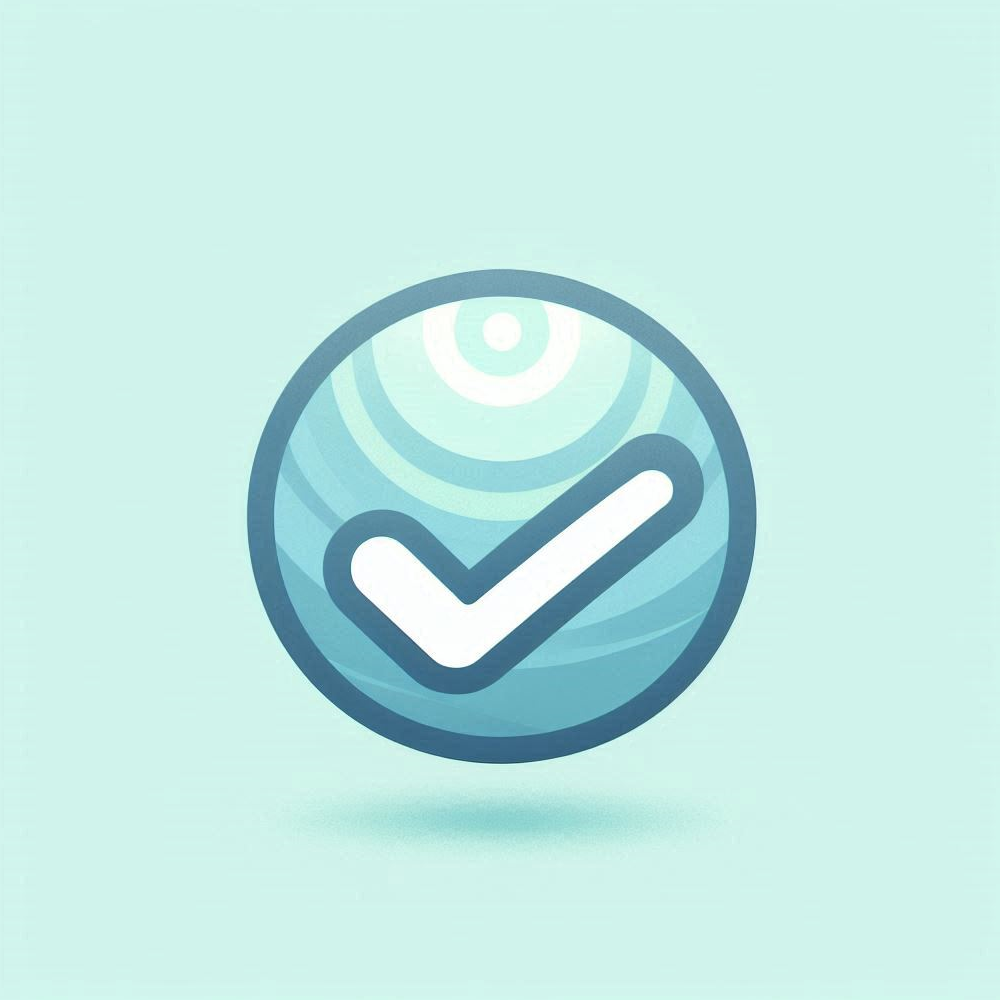
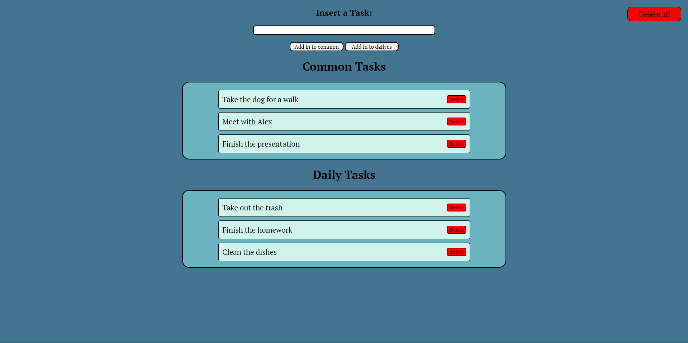
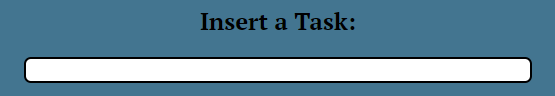
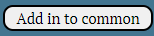
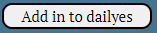
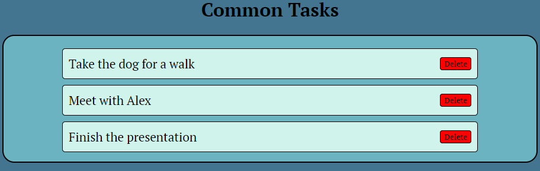
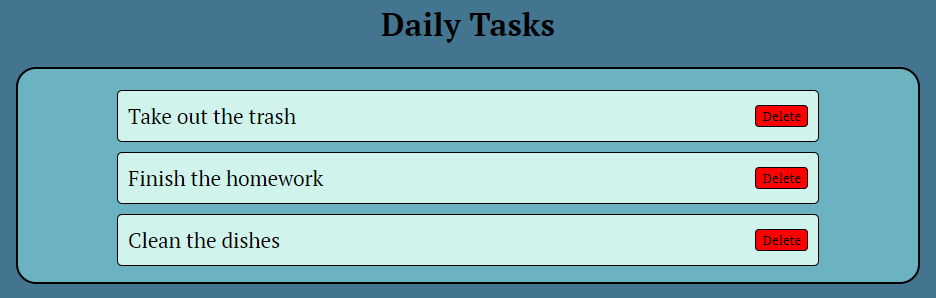

## Introducing
# **Never again: The ultimate to do app**

## What is never again?
Never Again is the ultimate to do App and the only one you will ever need. It is completely open source and if you don't like something about the app, you can always download the source code and modify it yourself.

## How does it work?
Never Again works by saving all of you tasks in 2 different lists. Just type your task in the input box:

And click the corresponding button to put the task in your desired list:
### Common tasks

### Daily tasks
 

### Common tasks

### Daily tasks

You can also find a universal delete button on the top right side of the page that deletes all of your tasks in one click.

All of your Tasks are saved locally on your browser, so for now your tasks that you saved on one device, won't be accessible on another device.

## Future updates
For the future I'm planning to enable a checkbox for every daily task, to mark the daily tasks as done. Also I'm planning on adding a schedule system for every task and push notifications to remind the user for his tasks.

#
You can find the website [here](https://buct0r.github.io/NeverAgain/). In the home page you will find a button to open the webapp.
Remember to add a star to the repo if you liked the webapp❤️

Developed by Buct0r
